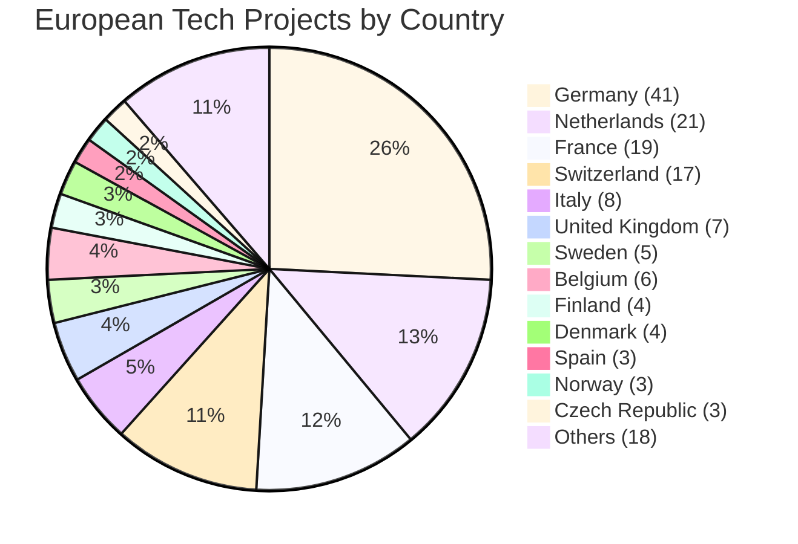

# Awesome European Tech 🇪🇺

**An up-to-date list of recommended European projects, curated by the community to support and strengthen the European tech ecosystem, specifically for users interested in privacy and sustainability.**

European software and companies often adhere to unique standards that provide significant benefits to users. These standards not only enhance user experience but also set a global benchmark for innovation, privacy, and sustainability. For example:

- **GDPR Compliance**: European companies are required to comply with the General Data Protection Regulation (GDPR), which ensures stricter data privacy and security for users compared to many other regions, including the U.S. This regulation has become a global gold standard for data protection.

- **Sustainability Standards**: Many European companies prioritize eco-friendly practices, such as utilizing renewable energy, reducing carbon emissions, and adopting circular economy principles. These efforts align with the EU’s ambitious Green Deal initiatives, making them leaders in sustainable innovation.

### Acceptance Criteria
1. **Compliance**: Must adhere to GDPR, UK GDPR, Swiss FADP, or other relevant European data protection frameworks.
2. **European Headquarters**: The company or project must be based in Europe.
3. **Technology Focus** Must be a company or project that leverages technology as a core component of its operations, products, or services.

### Disclaimer

This project is not about excluding non-European products or tools. There are countless exceptional global solutions that are widely used and appreciated. The purpose of this list is to highlight and support European startups and projects that excel in areas like privacy, sustainability, and innovation. By doing so, we aim to strengthen the European tech ecosystem while fostering collaboration and inclusivity across borders. Together, we can contribute to a more diverse, resilient, and interconnected global tech landscape.

Before exploring the list, we encourage you to visit the website that inspired this project: [European Alternatives](https://european-alternatives.eu/). 

### Contribute

Any contributions you make are **greatly appreciated**. If you have a suggestion that would make this better, please fork the repo and create a pull request. You can also simply open an issue with the tag "enhancement". Thanks again! ❤️

---

---
## Index
- [AI](#ai)
- [Browsers](#browsers)
- [CDN](#cdn)
- [Cloud](#cloud)
- [Communication Tools](#communication-tools)
- [DNS](#dns)
- [Domain Name Registrars](#domain-name-registrars)
- [E-commerce Platforms](#e-commerce-platforms)
- [FinTech](#fintech)
- [IDEs](#ides)
- [Instant Messaging Apps](#instant-messaging-apps)
- [Mail Providers](#mail-providers)
- [Navigation Apps](#navigation-apps)
- [Open-Source Projects](#open-source-projects)
- [Operating Systems (OS)](#operating-systems-os)
- [Password Manager Services](#password-manager-services)
- [Productivity Tools](#productivity-tools)
- [Search Engine](#search-engine)
- [Translation Services](#translation-services)
- [VPS](#vps)
- [VPN](#vpn)
- [Web Analytics](#web-analytics)
---

### AI
- [Cradle.bio](https://www.cradle.bio/) 🇳🇱 - AI-driven protein engineering for synthetic biology.
- [Gcore](https://gcore.com/) 🇱🇺 - Edge AI, cloud, and content delivery solutions.
- [Leya](https://www.leya.law/) 🇸🇪 - AI-powered legal research and contract analysis platform.
- [Mistral AI](https://mistral.ai/) 🇫🇷 - Open-source AI models for developers and enterprises.
- [Suse](https://www.suse.com/solutions/ai/) 🇩🇪 - Enterprise-grade AI/ML solutions for open-source environments.
- [Axelera](https://www.axelera.ai) 🇳🇱 - AI acceleration hardware for edge computing.
- [Next Epoch](https://nextepoch.ai/) 🇳🇱 - AI platform for developing and managing AI agents with full data sovereignty.
- [Timefold](https://timefold.ai/) 🇧🇪 - Planning AI / constraint solver for optimization problems

### Browsers
- [Falkon](https://www.falkon.org/) 🇩🇪 - Lightweight Qt-based browser
- [Mullvad](https://mullvad.net/en/download/browser/linux) 🇸🇪 - Privacy-focused browser
- [Otter Browser](https://otter-browser.org/) 🇵🇱
- [Vivaldi](https://vivaldi.com/) 🇮🇸

### CDN
- [Bunny CDN](https://bunnycdn.com) 🇲🇹
- [KeyCDN](https://www.keycdn.com) 🇨🇭
- [Leaseweb CDN](https://www.leaseweb.com/cdn) 🇳🇱
- [Myra CDN](https://www.myra-security.com/en/cdn) 🇩🇪
- [OVHcloud CDN](https://www.ovhcloud.com/en/cdn/) 🇫🇷

### Cloud
- [Aruba](https://www.aruba.it) 🇮🇹 - Cloud hosting and data center services.
- [Cozy](https://www.cozy.io) 🇫🇷 - Privacy-first personal cloud for data management.
- [datacrunch](https://datacrunch.io/) 🇫🇮 - GPU cloud computing for AI/ML workloads.
- [Elastx](https://www.elastx.se) 🇸🇪 - Managed cloud hosting with a focus on sustainability.
- [Exoscale](https://www.exoscale.com) 🇨🇭 - Scalable cloud infrastructure for developers.
- [Filen](https://www.filen.io) 🇩🇪 - End-to-end encrypted cloud storage.
- [Fuga Cloud](https://www.fuga.cloud) 🇳🇱 - OpenStack-based public cloud platform.
- [gridscale](https://www.gridscale.io) 🇩🇪 - Flexible IaaS and PaaS solutions.
- [Infomaniak kDrive](https://www.infomaniak.com/en/kdrive) 🇨🇭 - Cloud storage with collaboration tools.
- [Internxt](https://www.internxt.com) 🇪🇸 - Decentralized cloud storage prioritizing privacy.
- [IONOS](https://www.ionos.com) 🇩🇪 - Comprehensive cloud and web hosting services.
- [Jottacloud](https://www.jottacloud.com) 🇳🇴 - Cloud backup and file storage.
- [Koofr](https://www.koofr.eu) 🇸🇮 - Secure cloud storage with multi-provider integration.
- [Nextcloud](https://nextcloud.com/) 🇩🇪 - Self-hosted collaboration and file-sharing platform.
- [Open Telekom Cloud](https://open-telekom-cloud.com) 🇩🇪 - Enterprise cloud services by Deutsche Telekom.
- [OVHcloud](https://www.ovhcloud.com) 🇫🇷 - Global cloud provider with bare-metal servers.
- [pCloud](https://www.pcloud.com/) 🇨🇭 - Lifetime encrypted cloud storage plans.
- [Proton Drive](https://www.proton.me/drive) 🇨🇭 - Secure cloud storage from Proton.
- [Scaleway](https://www.scaleway.com) 🇫🇷 - Developer-friendly cloud and bare-metal solutions.
- [Seeweb](https://www.seeweb.it) 🇮🇹 - High-performance Italian cloud hosting.
- [STACKIT](https://www.stackit.de) 🇩🇪 - Cloud platform for businesses.
- [Tresorit](https://tresorit.com/) 🇨🇭 - End-to-end encrypted file sharing for enterprises.
- [UpCloud](https://www.upcloud.com) 🇫🇮 - High-speed cloud infrastructure with maxIOPS.

### Communication Tools
- [Element (Matrix)](https://element.io/) 🇬🇧 - Secure messaging via the Matrix protocol.
- [Jitsi](https://jitsi.org/) 🇫🇷 - Open-source video conferencing and chat.
- [Threema](https://threema.ch/) 🇨🇭 - Privacy-focused messaging with end-to-end encryption.
- [Wire](https://wire.com/) 🇨🇭 - Secure enterprise communication platform.

### DNS
- [Bunny DNS](https://bunny.net/dns) 🇲🇹
- [ClouDNS](https://www.cloudns.net) 🇧🇬
- [deSEC](https://www.desec.io) 🇩🇪
- [EuroDNS DNS](https://www.eurodns.com) 🇱🇺
- [Exoscale DNS](https://www.exoscale.com/dns) 🇨🇭
- [RcodeZero](https://www.rcodezero.at) 🇦🇹
- [Scaleway DNS](https://www.scaleway.com/dns) 🇫🇷
- [Quad9](https://quad9.net/) 🇨🇭

### Domain name registrars
- [Aruba Domains](https://www.aruba.it) 🇮🇹
- [Combell Domains](https://www.combell.com) 🇧🇪
- [Gandi](https://www.gandi.net) 🇫🇷
- [Hostinger Domain](https://www.hostinger.com) 🇱🇹
- [Hostpoint Domains](https://www.hostpoint.ch) 🇨🇭
- [Infomaniak Domains](https://www.infomaniak.com/en/domains) 🇨🇭
- [inwx](https://www.inwx.com) 🇩🇪
- [IONOS domains](https://www.ionos.com) 🇩🇪
- [netim](https://www.netim.com) 🇫🇷
- [Openprovider](https://www.openprovider.com) 🇳🇱
- [OVHcloud Domains](https://www.ovhcloud.com) 🇫🇷
- [United Domains](https://www.uniteddomains.com) 🇩🇪

### E-commerce Platforms
- [Mollie](https://www.mollie.com/) 🇳🇱 - Payment gateway for seamless online transactions.
- [PrestaShop](https://www.prestashop.com/) 🇫🇷 - Open-source e-commerce platform.
- [Shopware](https://www.shopware.com/) 🇩🇪 - Modern e-commerce solutions for businesses.

### FinTech
- [Adyen](https://www.adyen.com/) 🇳🇱 - Global payment processing for businesses.
- [Klarna](https://www.klarna.com/) 🇸🇪 - Buy now, pay later shopping solutions.
- [N26](https://n26.com/) 🇩🇪 - Mobile-first banking with no hidden fees.
- [Revolut](https://www.revolut.com/) 🇬🇧 - Digital banking and currency exchange app.
- [Wise (ex TransferWise)](https://wise.com/) 🇬🇧 - Low-cost international money transfers.

### IDEs
- [BlueJ](https://www.bluej.org/) 🇬🇧 - Java IDE for education and beginners.
- [Geany](https://www.geany.org/) 🇩🇪 - Lightweight IDE for multiple programming languages.
- [JetBrains](https://www.jetbrains.com/) 🇨🇿 - Developer tools and IDEs for efficient coding.

### Instant messaging apps
- [ginlo Private](https://www.ginlo.net) 🇩🇪 - Secure messaging for businesses and individuals.
- [Olvid](https://www.olvid.io) 🇫🇷 - Privacy-first messaging with zero metadata.
- [SKRED](https://www.skred.io) 🇳🇴 - Secure communication app.
- [TeleGuard](https://www.teleguard.com) 🇨🇭 - Encrypted messaging and calls.
- [Threema](https://www.threema.ch) 🇨🇭 - End-to-end encrypted messaging for privacy.

### Mail Providers
- [Disroot](https://disroot.org/en/services/email) 🇳🇱 - Privacy-focused email with open-source tools.
- [Mailbox.org](https://mailbox.org/) 🇩🇪 - Secure email with ad-free productivity suites.
- [Mailfence](https://www.mailfence.com/) 🇧🇪 - Encrypted email and document collaboration.
- [Posteo](https://posteo.de/) 🇩🇪 - Eco-friendly email with strong privacy.
- [ProtonMail](https://proton.me/mail) 🇨🇭 - Secure email with end-to-end encryption.
- [Runbox](https://runbox.com/) 🇳🇴 - Email provider with privacy focus.
- [Tutanota](https://tutanota.com/) 🇩🇪 - Encrypted email and calendar service.

### Navigation apps
- [HERE WeGo Maps & Navigation](https://wego.here.com) 🇳🇱
- [komoot](https://www.komoot.com) 🇩🇪
- [Magic Earth](https://www.magicearth.com) 🇭🇺
- [Mapy.cz](https://www.mapy.cz) 🇨🇿
- [OsmAnd](https://osmand.net) 🇨🇿
- [Organic Maps](https://organicmaps.app) 🇨🇾
- [Sygic GPS Navigation](https://www.sygic.com) 🇸🇰
- [TomTom GO Navigation](https://www.tomtom.com) 🇳🇱

### Open-Source Projects
- [Audacity](https://www.audacityteam.org/) 🇬🇧 - Free, open-source audio editing software.
- [Blender](https://www.blender.org/) 🇳🇱 - 3D creation suite for animation and modeling.
- [GIMP](https://www.gimp.org/) 🇩🇪 - Open-source image editing tool.
- [Krita](https://krita.org/) 🇳🇱 - Digital painting software for artists.

### Operating Systems (OS)
- [Canonical (Ubuntu)](https://canonical.com/) 🇬🇧 - Ubuntu Linux distribution and services.
- [KDE (Plasma Desktop)](https://kde.org/) 🇩🇪 - Customizable desktop environment for Linux.
- [SUSE](https://www.suse.com/) 🇩🇪 - Enterprise-grade Linux distribution.
- [UBports (Ubuntu Touch)](https://ubports.com/) 🇩🇪 - Mobile OS based on Ubuntu.

### Password manager services
- [heylogin](https://www.heylogin.com) 🇩🇪
- [Hypervault](https://www.hypervault.com) 🇧🇪
- [Padloc](https://padloc.app) 🇩🇪
- [Passbolt](https://www.passbolt.com) 🇫🇷
- [Password Depot](https://www.password-depot.com) 🇩🇪
- [pCloud Pass](https://www.pcloud.com/pass) 🇨🇭
- [Proton Pass](https://proton.me/pass) 🇨🇭
- [uniqkey](https://www.uniqkey.com) 🇩🇰

### Productivity Tools
- [CryptPad](https://cryptpad.fr/) 🇫🇷 - End-to-end encrypted collaboration suite.
- [Formbricks](https://formbricks.com/) 🇩🇪 - Open-source survey and feedback tool.
- [Joplin](https://joplinapp.org/) 🇫🇷 - Note-taking app with sync and encryption.
- [LibreOffice](https://www.libreoffice.org/) 🇩🇪 - Free and open-source office suite.
- [OnlyOffice](https://www.onlyoffice.com/) 🇱🇻 - Collaborative office suite for teams.
- [Raspberry Pi](https://www.raspberrypi.com/) 🇬🇧 - Affordable single-board computers for DIY projects.

### Search engine
- [Ecosia](https://www.ecosia.org) 🇩🇪 - Carbon-neutral search engine planting trees.
- [Qwant](https://www.qwant.com) 🇫🇷 - Privacy-respecting search engine from France.
- [Startpage](https://www.startpage.com) 🇳🇱 - Private search with Google results.
- [Swisscows](https://www.swisscows.com) 🇨🇭 - Family-friendly search engine with no tracking.

### Translation services
- [DeepL](https://www.deepl.com) 🇩🇪 - AI-powered translation with high accuracy.
- [eTranslation](https://ec.europa.eu/cefdigital/wiki/display/ETRANSLATION/eTranslation) 🇧🇪
- [ModernMT](https://www.modernmt.com) 🇮🇹 - Adaptive machine translation for enterprises.
- [Reverso](https://www.reverso.net) 🇫🇷 - Context-aware translation and language tools.
- [Textshuttle](https://www.textshuttle.ai) 🇨🇭 - AI-driven translation for businesses.

### VPS
- [AlphaVPS](https://www.alphavps.com) 🇧🇬
- [Aruba Cloud](https://www.arubacloud.com) 🇮🇹
- [cloudscale](https://www.cloudscale.ch) 🇨🇭
- [Combell Cloud](https://www.combell.com/en/cloud) 🇧🇪
- [Contabo](https://www.contabo.com) 🇩🇪
- [Hetzner](https://www.hetzner.com) 🇩🇪
- [netcup](https://www.netcup.eu) 🇩🇪
- [Tilaa](https://www.tilaa.com) 🇳🇱
- [V.PS](https://www.v.ps) 🇳🇱
- [Virtua.Cloud](https://www.virtua.cloud) 🇫🇷

### VPN
- [AirVPN](https://www.airvpn.org) 🇮🇹 - Privacy-focused VPN with open-source ethos.
- [F‑Secure FREEDOME VPN](https://www.f-secure.com) 🇫🇮 - VPN with malware blocking.
- [Mullvad VPN](https://www.mullvad.net) 🇸🇪 - No-logs VPN with anonymous accounts.
- [GOOSE VPN](https://www.goosevpn.com) 🇳🇱 - Dutch VPN provider with no-log policy.
- [OctoVPN](https://www.octovpn.com) 🇩🇰 - High-performance gaming VPN with DDoS protection.
- [Xeovo](https://www.xeovo.com) 🇫🇮 - Privacy-focused VPN with anonymous payments.

### Web Analytics
- [Alceris](https://www.alceris.com) 🇫🇷 - AI-driven analytics for web performance and SEO.
- [Analyzati](https://analyzati.com) 🇪🇸 - Privacy-friendly web analytics for businesses.
- [Counter](https://counter.com) 🇳🇱 - Lightweight, open-source web analytics.
- [digistats](https://digistats.io) 🇩🇪 - Analytics with real-time tracking.
- [Dreamdata](https://www.dreamdata.io) 🇩🇰 - B2B revenue attribution and data platform.
- [etracker](https://www.etracker.com) 🇩🇪 - Visitor analytics and heatmaps.
- [fusedeck](https://fusedeck.com) 🇨🇭 - Swiss real-time tracking and analytics.
- [Friendly Analytics](https://friendlyanalytics.com) 🇨🇭 - Open-source and privacy-focused analytics.
- [Insights](https://insights.ai) 🇳🇱 - AI-driven data analytics and reporting.
- [Matomo by Stackhero](https://www.stackhero.io) 🇫🇷 - Managed Matomo analytics hosting.
- [Mouseflow](https://www.mouseflow.com) 🇩🇰 - Session replay and heatmaps for UX analysis.
- [nilly](https://nilly.com) 🇧🇪 - Privacy-first analytics with simple dashboards.
- [Offen](https://offen.dev) 🇩🇪 - Self-hosted web analytics with user-first privacy.
- [Pirsch](https://pirsch.io) 🇩🇪 - Simple, cookie-free, and GDPR-compliant analytics.
- [Publytics](https://publytics.com) 🇮🇹 - SEO and performance monitoring analytics.
- [SEAL Metrics](https://sealmetrics.com) 🇪🇸 - Cookieless web analytics for GDPR compliance.
- [Sitesights](https://sitesights.com) 🇩🇪 - privacy-friendly analytics.
- [Stormly](https://stormly.com) 🇳🇱 - AI-powered business intelligence platform.
- [Swetrix](https://swetrix.com) 🇺🇦 - Lightweight analytics with real-time tracking.
- [TelemetryDeck](https://telemetrydeck.com) 🇩🇪 - Privacy-first telemetry for apps.
- [tinylytics](https://tinylytics.com) 🇳🇱 - Simple web analytics for indie developers.
- [Vantevo](https://vantevo.com) 🇮🇹 - Analytics with real-time insights.
- [Visitor Analytics](https://www.visitor-analytics.io) 🇷🇴 - Website analytics and behavior tracking.
- [Wide Angle Analytics](https://wideangleanalytics.com) 🇵🇱 - Privacy-first analytics with EU data hosting.
